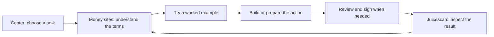

# Learning from Derive v3: a documentation and usability plan for Juicebox

The biggest opportunity is to make Juicebox's documentation a continuous path from understanding an economic decision to inspecting its result. Derive provides a strong example of organizing complicated infrastructure around useful jobs. Juicebox already has substantial technical content and several of the right entry points. Its next advantage should be the connection between explanations, working examples, product actions, and independently inspectable evidence.

**Recommended direction:** Center helps people choose and integrate; Juicebox Money teaches configurable project funding; Revnet Money teaches economic commitments; Juicescan lets people verify what the contracts and transactions actually did. Maintain shared protocol facts once, while giving each product its own focused journeys.

## Evidence and scope

This assessment covers public documentation and responses inspected on September 11, 2026, together with the corresponding local source files. It includes Derive's v3 architecture, onboarding, SDK examples, vault lifecycle, permissions, operational guidance, schemas, and migration documentation. Juicebox Money and Revnet Money were inspected through their public Learn and Build pages. Center's directory, API page, journey documentation, and capability response were retrieved directly. Juicescan was located through Center's published directory, then its static deployment, agent index, and JavaScript bundle were inspected.[1](https://docs.derive.xyz/) [2](https://juicebox.center/) [3](https://juicebox.money/build) [4](https://revnet.money/build)

These are documentation and implementation observations, followed by usability judgments and recommendations. No wallets were connected, trades executed, projects launched, or funds moved. No participant study, rendered mobile review, accessibility audit, or latency benchmark was performed. The report consequently makes no claim that Derive converts better, that its examples all execute successfully, or that its product performs better in production.

Version discipline is especially important here. Derive's introduction labels v3 mainnet as coming soon, although its homepage and several guides contain mainnet examples. This is a documented v3 experience with some availability ambiguity, not evidence of a fully validated mainnet rollout.[5](https://docs.derive.xyz/getting-started/introduction)

## 1. What Derive v3 is doing well

### It reduces the underlying integration burden

Derive describes v3 as combining its exchange and chain into a ZK application settling directly to Ethereum L1. Its migration explanation removes the intermediate Derive smart-contract wallet and separate Derive Chain from the user's funding path. Accounts can be owned by an EOA or a contract; the first deposit creates the initial account and subaccount. These are product and architecture changes that make simpler documentation possible.[6](https://docs.derive.xyz/migrating/v3-improvements)

That distinction matters. Better prose cannot compensate for forcing every Juicebox builder through protocol selection, account enrollment, bot registration, smart-wallet setup, and transport selection before they can read a project. Each of those steps should appear only in journeys that require it. Center already documents public discovery, MCP access without REST enrollment, and separate protected REST workflows. The improvement is to keep those short paths obvious throughout the experience.[7](https://juicebox.center/api/docs/quickstart)

The transferable lesson is to remove unnecessary prerequisites and choose a sensible starting path. Juicebox's multichain architecture serves a different purpose; Derive's L1 consolidation is not a reason to remove it. A first tutorial can start on one chain and introduce cross-chain coordination once the reader has a working payment.

### Its new capabilities have recognizable user jobs

Derive's v3 feature overview describes native permissionless vaults, isolated risk universes, lending pools for each collateral, more granular session permissions, and external transfers with recipient whitelists. In particular, it presents lending as expanding beyond v2's USDC-only model. These are documented capabilities; their runtime availability was not tested here.[35](https://docs.derive.xyz/migrating/new-features)

| V3 capability | Usability lesson | Relevant Juicebox application |
| --- | --- | --- |
| Native vault creation and operation | Package a full business lifecycle behind a recognizable product concept. | Make launch, operation, funding, and permitted exits one project journey. |
| Risk universes and managers | Explain what a configuration enables and which boundary contains a risk. | Explain the actual scope of a project's permissions, hooks, and cross-chain dependencies. |
| Lending across collateral assets | Surface compatibility and current conditions where the user chooses an asset. | Explain supported Revnet loan sources and current terms without implying the same lending design. |
| Granular keys and recipient restrictions | Make automation authority understandable before activation. | Show the difference between API access and approved wallet execution. |

The comparison is about presenting choices and boundaries. Derive's pooled lending and Revnet's token-backed loans have different mechanics; project separation should not be described as equivalent to Derive's risk-universe isolation.

### It leads with a useful result

Derive's homepage presents an integration promise, executable-looking SDK examples, and three specific audiences: application builders, trading-system builders, and vault operators. Its quickstart names a concrete result: a resting ETH-PERP testnet order. It supplies wallet and faucet prerequisites, collateral selection, deposit steps, and account readiness checks.[1](https://docs.derive.xyz/) [8](https://docs.derive.xyz/getting-started/quickstart)

This reduces the reader's initial question to whether the guide solves their job. It also provides an observable destination. A comparable Juicebox result is “read a project's current terms,” then “make a test payment and verify the issued tokens.” “Understand the SDK” is an intermediate activity, not the result.

Juicebox Money already offers launch, app, and contract paths, so adding more audience cards is not the main need. Its existing read tutorial asks readers to create or locate a test project and replace a placeholder ID. Maintaining an available sample project would remove that discovery burden from a read-only first success. Preserve the ability to substitute any project.[3](https://juicebox.money/build)

### It explains concepts at the decision point

Derive introduces managers and risk universes when an integrator must select compatible collateral and instruments. A manager determines the margin model and the associated risk universe. The guide connects that model to a discovery endpoint, so support is something an application can inspect instead of assuming from a static diagram.[9](https://docs.derive.xyz/trading/managers-and-risk-universes)

The Juicebox equivalent is to explain a rule when it changes the decision in front of someone. Reserved issuance belongs beside the payer's token output. Cash-out terms belong beside the available quote. Operator powers belong beside the revnet's commitment schedule. Accepted payment assets belong beside the selected chain and route.

This should be progressive explanation, with a short answer first and exact mechanics available immediately. It should not require readers to finish a glossary before making sense of a payment.

### It treats operations and exits as part of the product

Derive's vault documentation divides the operator's job into creation, fees, processing deposits and withdrawals, trading, and winddown. The creation guide distinguishes immutable parameters and required curator permissions. That is a more useful organizing principle than a flat inventory of endpoints.[10](https://docs.derive.xyz/vaults/create-a-vault)

The withdrawal guide separates a shareholder's signed request from curator settlement and protocol execution. It explains that liquidity may not always be immediately available. Its stated 14-day processing expectation includes possible freezing or delisting; that wording should not be interpreted as a demonstrated unconditional onchain redemption guarantee.[11](https://docs.derive.xyz/vaults/deposits-withdrawals)

The winddown guide explains the final state: a burn that takes total shares to zero closes the vault permanently. It gives an ordered procedure and explains why the curator exits last.[12](https://docs.derive.xyz/vaults/winddowns)

Juicebox should give “operate,” “recover,” and “leave” equal editorial weight to “launch.” The procedures will differ: a revnet does not inherit Derive's curator-driven winddown model. Explain the exits and control transitions that each actual contract permits, including cases where no universal shutdown exists.

### It distinguishes kinds of authority

Derive separates protocol scopes from offchain scopes. Protocol scopes authorize state-changing actions; server-side scopes gate API capabilities. Its dedicated permission explanation includes diagrams and examples rather than leaving this distinction implicit in authentication snippets.[13](https://docs.derive.xyz/authentication/access-scopes)

Center already has an analogous distinction worth making much more visible: a bot's API grant is not permission to spend an owner's funds. The inspected capability response reports fresh owner approval and no supported onchain session keys in its transaction authorization object. Its journey docs also distinguish configured sponsored execution from execution actually verified with signed V6 transactions.[14](https://juicebox.center/api/v1/capabilities) [15](https://juicebox.center/api/docs/user-journeys)

Borrow the clarity of Derive's presentation. Do not transplant its delegation model or weaken Center's approval boundary to shorten a tutorial.

### It documents the waiting and failure states

Derive's onboarding guide describes multiple deposit routes and how to observe progress through account crediting. It distinguishes an observed transfer from exchange readiness. Its error catalog explicitly directs clients to query order state before resubmitting after confirmation timeouts.[16](https://docs.derive.xyz/getting-started/depositing) [17](https://docs.derive.xyz/error-codes)

Its rate-limit guide explains budget ownership, different limiting mechanisms, and runtime introspection. Its cancel-on-disconnect guide documents a deliberate response to lost connectivity rather than treating network failure as an afterthought.[18](https://docs.derive.xyz/rate-limits) [19](https://docs.derive.xyz/trading/cancel-on-disconnect)

Juicebox needs the same editorial prominence for wallet rejection, pending Safe proposals, stale quotes, unknown broadcasts, indexer delay, and partial cross-chain settlement. Center and the Money sites already describe many of these distinctions. Turn them into task-specific recovery pages and contextual links, preserving the semantics each product actually implements.

### It serves humans and coding agents from the same documentation surface

Derive exposes an index, Markdown pages, OpenAPI, AsyncAPI specifications, and a concise skill document. Its migration guide is explicitly packaged for coding agents, while the changelog explains concrete compatibility changes such as renamed session-key methods and settlement status fields.[20](https://docs.derive.xyz/llms.txt) [21](https://docs.derive.xyz/skill.md) [22](https://docs.derive.xyz/migrating/breaking-changes) [23](https://docs.derive.xyz/changelog)

The useful pattern is discoverability plus precision: an agent can locate the relevant task, resolve the current interface, and inspect the migration implications. Juicebox already has skills, SDK builders, deployment artifacts, and Center's generated specification. Connect those resources more consistently rather than creating a competing agent knowledge base.

## 2. Where to improve on Derive

Derive is a useful benchmark, not a finished standard to copy wholesale.

| Observed issue | Practical implication | Juicebox response |
| --- | --- | --- |
| Introduction says mainnet is coming soon; homepage examples use mainnet. | Readers must infer whether an example is immediately usable. | Derive every example's environment and availability label from reviewed release metadata. |
| “Coming soon” lists margin methods and public liquidation history that also appear in the inspected OpenAPI specification. | Schema presence and runtime availability are not clearly distinguished. | Publish configured, supported, tested, and unavailable as separate facts with verification dates. |
| The skill document contains an apparent `v3.dosc.derive.xyz` hostname typo. | An agent can be routed away from authoritative contract information. | Check machine-facing links as part of the same release checks as human navigation. |
| Quickstart copy promises five steps, but the rendered guide continues to a sixth trading step. | Small editorial inconsistencies weaken confidence in copy-and-run instructions. | Generate numbered steps from the tutorial structure and execute complete examples. |
| Vault creation advertises a short launch time but also requires a funded account, permissions, and economic choices. | Setup time can be mistaken for decision readiness. | Label “time to run” separately from prerequisites and review effort. |

These are documentation observations, not findings that the protocol is broken. The conflicting availability evidence does not establish whether those methods work at runtime.[1](https://docs.derive.xyz/) [5](https://docs.derive.xyz/getting-started/introduction) [8](https://docs.derive.xyz/getting-started/quickstart) [10](https://docs.derive.xyz/vaults/create-a-vault) [21](https://docs.derive.xyz/skill.md) [24](https://docs.derive.xyz/migrating/coming-soon) [25](https://docs.derive.xyz/openapi.json)

The larger opportunity is independent verification. A polished happy path helps someone start; a visible explanation of what can change, what has been authorized, and what actually settled helps them continue with confidence. Juicebox has unusually useful raw material for this because its explorer can connect explanations to specific projects, contracts, and transactions.

## 3. The current Juicebox position

### Juicebox Center

Center already has a role-based directory, an API explorer, public capability discovery, generated OpenAPI, a browser/CLI quickstart, MCP guidance, and unusually explicit transaction lifecycle documentation. The homepage asks what the visitor wants to do and routes through a decision graph. The API page already offers paths for data, transactions, and integrations.[2](https://juicebox.center/) [26](https://juicebox.center/api)

The next improvement is the distance from selection to useful output. Give frequent jobs direct destinations alongside the directory graph. For example: inspect a sample project's terms, connect an agent for a read-only task, or prepare a payment without signing it. Keep detailed enrollment instructions on the protected REST path.

A specific discoverability gap is confirmed: `https://juicebox.center/llms.txt` returned HTTP 404 during this assessment. That does not mean Center lacks agent support. It means the obvious machine-readable entry point does not currently lead to the resources it already has. Add a small index pointing to current capabilities, OpenAPI, MCP setup, task guides, and versioned skills.[27](https://juicebox.center/llms.txt)

### Juicebox Money

The public Build guide contains 42 sections; Learn contains 24. They already have audience entry points, economic explanations, SDK setup, transaction references, and AI guidance. The principal weakness is therefore not lack of breadth. It is the amount of material surrounding each first task.[3](https://juicebox.money/build) [28](https://juicebox.money/learn)

Preserve the long reference, including its existing anchors. Extract a small number of focused tutorials with prerequisites, a complete example, expected output, and a direct inspection link. Shared sections should supply those pages rather than being copied and independently rewritten.

The first tutorial should work without launching anything or finding an unexplained project ID. The second should complete one testnet payment from input to a verified receipt and token outcome. More advanced routes can build on that same example.

### Revnet Money

Revnet's public Learn and Build guides have 16 and 29 sections respectively. The Learn guide already distinguishes issuance, market, and cash-out prices. It also explains that operator powers and dependencies still matter despite the committed stage schedule. Build covers drafts, parameter choices, SDK reads, transaction construction, loans, and multichain operations.[4](https://revnet.money/build) [29](https://revnet.money/learn)

The highest-value addition is a worked economic model that follows one example through changing time and revenue assumptions. Show what is fixed, what remains adjustable, where the payment goes, and how the three prices can differ. A hypothetical illustration must be labeled as such; a live quote must identify its state and freshness.

Make the model feed a reviewable launch draft, then compare that draft with the actual deployed terms. The existing draft and modeling resources are starting points to connect, not reasons to invent another configuration format.

### Juicescan

Center currently links Juicescan through a CID-addressed deployment. Its agent index explicitly says Learn and Build are hash-routed browser content and that most content requires the bundle. Its source includes contract-derived forms, deployment data, transaction builders, and protocol explanations.[30](https://bafybeidt2dd3bsiyyk6rfkjuuglcpjvojxeztxd2g4esamopeybpcj25di.eth.sucks/llms.txt) [31](https://github.com/mejango/juicescan)

Both the local guide and the linked public bundle contain wording that describes tokens as a stake, says the revnet token price is predetermined, and uses absolute trust claims. Those statements are broader than the more careful distinctions in the current Money guides. A committed issuance schedule does not fix an external market price, and remaining operator powers and dependencies should be described plainly.[32](https://bafybeidt2dd3bsiyyk6rfkjuuglcpjvojxeztxd2g4esamopeybpcj25di.eth.sucks/app.js) [29](https://revnet.money/learn)

Correcting this drift is a higher priority than adding more overview prose. Then make Juicescan the place where an explanation can be checked: current rules, exact call, emitted events, balance changes, and any unresolved observations. Publish static Markdown or HTML copies of the guides in the same bundle so reading them does not require executing the application.

## 4. One coordinated information architecture

Use the same verbs across the ecosystem: **Learn, Build, Inspect**. These can describe connected journeys without requiring identical navigation on every site or replacing the existing Audit destination.

| Site | Primary responsibility | First successful visit | Next handoff |
| --- | --- | --- | --- |
| Center | Find the right product, data source, API, or agent workflow. | Choose a job and obtain a useful resource or read-only result. | A specific guide, sample, or inspection target. |
| Juicebox Money | Understand, launch, fund, and operate configurable projects. | Explain a payment or prepare a coherent project draft. | Inspect its rules or receipt in Juicescan. |
| Revnet Money | Understand and model committed economic schedules. | Compare a scenario and identify fixed versus adjustable terms. | Review a draft, then inspect deployed terms. |
| Juicescan | Inspect protocol state and compose exact operations. | Answer what happened and what evidence supports it. | Return to the relevant explanation or next permitted action. |

A shared conceptual route looks like this:

Preserve project identity and context during handoffs: protocol version, chain ID, project ID, the relevant ruleset or transaction, and environment. A multichain grouping must not silently replace a chain-specific identity. Only pass public context in links; do not put credentials or signing material in URLs.

Keep shared explanations and generated facts in a small versioned content source. The existing repository and build pipelines are sufficient starting points. Shared content should cover economic definitions, units, fee explanations, authority distinctions, and transaction states. Product-specific pages should cover actual buttons, workflows, and examples. This permits different voices without contradictory mechanics.

## 5. The first six journeys to ship

### A. Understand a payment

Start with one maintained example and a visible amount. Explain the selected chain, payment asset, issuance or market route, tokens reaching the payer, reserved allocation where applicable, and relevant fees. Show how the answer changes when a meaningful setting changes. End with “inspect these terms” and the underlying reads.

The learning objective is that a reader can explain where the money goes and what they receive. Do not lead with a contract taxonomy.

### B. Read a project in a few minutes

Promote the existing SDK example into a standalone quickstart with a maintained sample identity, pinned dependency version, one complete file, and expected output. Keep it wallet-free. Include one explicit failure example for a nonexistent project or unavailable RPC. Provide a recorded fixture as an offline learning option, clearly distinguished from live state.

Success is a current ruleset read that matches the relevant project view. Establish the actual completion time with new builders before making a time claim.

### C. Make and verify a test payment

Extend the same project example through fresh reads, a quote, exact transaction construction, simulation, decoded review, wallet submission, and reconciliation. Explain ERC-20 approval only on a route that needs it. Prefer an initial route with few dependencies, then add routed payments as a follow-up.

Finish with transaction evidence and observed token output, not just a hash. Provide a safe test cash-out path when the sample project's terms permit one; if they do not, explain the actual constraint.

### D. Design and inspect a revnet

Use one fictional business and several explicit revenue scenarios. Show stage transitions, issuance changes, split allocations, cash-out conditions, and remaining operator powers. Explain issuance price, market price, and cash-out value side by side. Include a low-revenue case and a case with no useful market liquidity.

Export the model into the existing draft workflow. After a test launch, compare deployed settings with the reviewed draft, including chain-specific differences. Treat this as a model of rules and assumptions, not a forecast of token returns.

### E. Give an agent useful access

Start with public discovery or an MCP read-only task. Introduce a protected REST bot only when the integration needs that path. Show a compact authority table: public information, authenticated reads, planning, relay, and separately authorized wallet execution.

Give a concrete task such as “explain this project's current cash-out terms and cite the reads.” Then show how to prepare an unsigned action. Any recurring execution example must depend on current capability evidence; do not promote an inactive session feature as available.

### F. Recover an uncertain operation

Create one common recovery entry point with product-specific cases. Let the reader identify whether the wallet rejected the request, a Safe proposal is awaiting execution, a transaction is pending, a receipt reverted, indexed data is lagging, or a bridge destination has not completed.

For each state, show what is known, what is still unknown, which identifier to inspect, and the next safe check. State whether retrying is appropriate and which existing identifiers must be preserved. Do not turn every error into a generic “try again” button.

## 6. A reusable page standard

Every task guide should answer these questions in this order:

1. **Result:** What will I have accomplished?
2. **Prerequisites:** Which environment, sample, wallet, funds, permissions, and package version are actually required?
3. **Decision:** What choice changes the outcome, and what is the recommended starting example?
4. **Steps:** What complete action or code do I run?
5. **Expected result:** What should I see, including pending states?
6. **Verification:** Which reads, receipts, events, or state comparisons establish success?
7. **Recovery:** What commonly prevents completion, and what should I inspect next?
8. **Next task:** Where does this result lead?

Reference pages should additionally identify units, exact types, permission requirements, side effects, and source version. Economic pages should identify assumptions, which values are configurable, and whether an example is hypothetical or based on current state.

For example, a cash-out explanation could show one small hypothetical project with no hooks, one accounting token, and explicitly chosen rules. Display the balance, the remaining payout limit, the resulting surplus, and the token position. Then change one input at a time. Use the existing SDK math for the detailed output and reconcile it against contract simulation where supported. Avoid teaching an oversimplified proportional formula as the general rule.

## 7. Engineering and editorial foundations

### Share facts and test examples

Generate addresses and ABI references from the existing deployment artifacts. Preserve dynamic resolution of project-specific controllers, terminals, and hooks. Use the SDK's current transaction builders rather than independently encoding another example implementation. Center's OpenAPI generation already draws from operation descriptors and pinned catalogs; extend the established mechanism where appropriate.[33](../extensions/jbcenter/src/rest/docs/README.md) [34](../webclients/juicebox-money/src/lib/build-guide.ts)

Extract complete tutorial code into runnable files, pin the tested package version, and render those files into the guide. A link checker will not catch an obsolete SDK export, a mismatched unit, or a wrong environment. Check those where the examples exercise them. For financial examples, include expected invariants and clearly distinguish a simulation from an executed transaction.

### Publish a small compatibility record

For each canonical tutorial, record protocol version, SDK release, supported chains, sample project identity, source revision, and last successful verification. Separate protocol version from historical repository names: an older-looking repository name should not force a newcomer to guess whether its current exports support V6.

Provide an explicit migration guide for supported older integrations. Cover changed concepts, functions, units, returned values, and verification requirements. Adapt Derive's agent-ready migration format, but ensure the migration instructions point to the same compatibility record as the human guide.

### Make agent support portable

Add Center's missing index and publish readable task pages. Publish Juicescan's Learn and Build text as static assets. Keep the existing Juicebox skills discoverable from all four sites, with relevant subsets linked by task. A short entry document should explain where to find current interfaces and capabilities; it should not duplicate all fee math and protocol semantics.

OpenAPI fits Center's HTTP surface. ABIs and typed SDK interfaces fit onchain calls. Bendystraw has its own query schema. AsyncAPI should be added only if an actual supported streaming surface needs it. Copying Derive's file list without the corresponding service would create misleading documentation.

### Build on existing inspection capabilities

Use Juicescan's contract directory, data views, and transaction presentation to connect documentation examples to evidence. When additional UI is required, start with one operation and a small factual panel. Show the data source, relevant block or observation time, expected effect, observed effect, and unresolved items.

Do not create a universal abstraction before the first journey works. In particular, a successful Safe batch receipt does not automatically prove every modeled economic effect, and a source-chain receipt does not establish destination settlement. Center's existing documentation makes these limits explicit; keep them visible when packaging the experience.[15](https://juicebox.center/api/docs/user-journeys)

## 8. A practical 90-day rollout

This is a planning estimate, assuming one accountable documentation/product lead, one frontend/SDK engineer, and part-time protocol and Center review. Adjust duration to staffing. Sequence by completed journeys rather than page count.

| Phase | Work | Completion gate |
| --- | --- | --- |
| Weeks 1–2: establish accuracy | Correct Juicescan's overbroad economic claims; inventory shared facts and existing anchors; verify canonical links; add Center's agent index; choose a maintained test project; observe baseline tasks. | The same basic economic questions receive consistent answers across all four surfaces. |
| Weeks 3–4: finish one path | Ship “read a project” and “make a test payment” as complete examples; connect Learn, Build, and inspection; add context-preserving links. | A new builder completes the read without a wallet and the test payment without undocumented assistance. |
| Weeks 5–8: explain decisions and recovery | Ship the revnet scenario example, authority table, and recovery guides; expose Juicescan guide text without JavaScript. | Readers can identify fixed terms, remaining powers, and the state of an uncertain transaction. |
| Weeks 9–12: make it maintainable | Add example execution checks, compatibility metadata, shared content publishing, and migration guidance; improve search based on observed queries. | A relevant SDK or protocol change identifies and checks its affected docs before release. |

Assign ownership by responsibility: the protocol reviewer approves economic semantics; the SDK maintainer owns executable snippets; the Center maintainer owns capability and authentication accuracy; product maintainers own navigation and in-context explanations. The documentation lead owns the complete cross-site journey and ensures it does not break at a handoff.

Do not begin with a site-wide redesign, documentation-platform migration, three new language SDKs, or a chatbot. None is necessary to validate the first connected journey. A new language SDK should follow actual integration demand and a credible maintenance owner.

## 9. How to know the changes worked

Measure task completion and understanding. Pageviews alone cannot tell whether someone learned what a cash out depends on or built a correct payment flow.

| Question | Baseline exercise | Initial acceptance criterion |
| --- | --- | --- |
| Can a newcomer understand a payment? | Ask five new readers where the money goes, what they receive, and what can change. | At least four explain the selected example correctly without prompting. |
| Can a builder start? | Observe five builders running the read quickstart. | At least four finish within ten minutes without needing a wallet or private help. |
| Does the first write work? | Observe a testnet payment through result inspection. | Completion includes the relevant receipt and token outcome, not only submission. |
| Are revnet commitments understood? | Ask readers to distinguish the three prices and identify remaining operator powers. | At least four of five correctly explain both distinctions. |
| Can someone recover? | Give a pending proposal or delayed-indexing scenario. | The reader identifies the existing operation and checks its status before initiating a duplicate. |
| Do docs remain usable for agents? | Give a fresh agent a project-read task using only published entry points. | It finds current V6 interfaces, returns evidence, and requests no unnecessary credentials. |

These are proposed pilot thresholds, not measured results or statistically representative findings. Record failures qualitatively and repeat the exercise after meaningful changes. Track time to first useful result, completion by task, unresolved search queries, stale examples, and cross-site handoff abandonment. Collect the minimum telemetry required; wallet identities and balances are not necessary to measure documentation navigation.

## 10. The decision to make now

Fund a narrow first milestone: **one maintained example project, one excellent read tutorial, one complete test payment tutorial, and one inspection path shared across the sites**. In parallel, fix the economic wording that already disagrees and make existing machine-readable resources easier to discover.

Derive's best lesson is the coherence of its promise, task guides, and operational model. Juicebox can go further by making every important explanation lead to evidence a person can inspect. The investment should make that connection dependable before expanding the documentation surface.

## Sources

All public resources below were inspected September 11, 2026. Most are living documents without displayed publication dates. Capability responses describe the observed configuration, not a permanent guarantee. Local source links refer to the reviewed workspace and may include work not yet deployed.

1. Derive. [Documentation homepage](https://docs.derive.xyz/). Audience paths, SDK examples, machine-readable entry points.
2. Juicebox Center. [Directory](https://juicebox.center/). Public journey routing and canonical Juicescan destination.
3. Juicebox Money. [Build on Juicebox](https://juicebox.money/build). Existing 42-section guide and SDK quickstart.
4. Revnet Money. [Build with revnets](https://revnet.money/build). Existing 29-section guide, drafts, modeling, integrations.
5. Derive. [Introduction](https://docs.derive.xyz/getting-started/introduction). Architecture, interfaces, environment table.
6. Derive. [DevEx improvements](https://docs.derive.xyz/migrating/v3-improvements). V3 architecture and onboarding changes.
7. Juicebox Center. [Quickstart](https://juicebox.center/api/docs/quickstart). Public, MCP, bot, and wallet paths.
8. Derive. [Quickstart](https://docs.derive.xyz/getting-started/quickstart). Testnet prerequisites and first order.
9. Derive. [Managers & Risk Universes](https://docs.derive.xyz/trading/managers-and-risk-universes). Conceptual model and capability discovery.
10. Derive. [Create a Vault](https://docs.derive.xyz/vaults/create-a-vault). Operator lifecycle and immutable configuration.
11. Derive. [Process Deposits & Withdrawals](https://docs.derive.xyz/vaults/deposits-withdrawals). Request and settlement flow.
12. Derive. [Winddowns](https://docs.derive.xyz/vaults/winddowns). Closure procedure and terminal state.
13. Derive. [Access Scopes](https://docs.derive.xyz/authentication/access-scopes). Protocol and server authority.
14. Juicebox Center. [Live capabilities](https://juicebox.center/api/v1/capabilities). Configuration, authorization, chains, transport limits.
15. Juicebox Center. [User journeys](https://juicebox.center/api/docs/user-journeys). Execution evidence and current limitations.
16. Derive. [Programmatic Onboarding](https://docs.derive.xyz/getting-started/depositing). Deposit methods and readiness observation.
17. Derive. [Error Codes](https://docs.derive.xyz/error-codes). Error catalog and confirmation-timeout recovery.
18. Derive. [Rate Limits](https://docs.derive.xyz/rate-limits). Budget semantics and introspection.
19. Derive. [Cancel on Disconnect](https://docs.derive.xyz/trading/cancel-on-disconnect). Operational protection.
20. Derive. [Documentation index](https://docs.derive.xyz/llms.txt). Machine-readable discovery.
21. Derive. [Agent skill](https://docs.derive.xyz/skill.md). Agent entry points and observed hostname typo.
22. Derive. [Migration skill for your coding agent](https://docs.derive.xyz/migrating/breaking-changes). Breaking changes and migration instructions.
23. Derive. [Changelog](https://docs.derive.xyz/changelog). Displayed July 2026 changes, including settlement statuses.
24. Derive. [Coming soon](https://docs.derive.xyz/migrating/coming-soon). Feature availability statements.
25. Derive. [OpenAPI specification](https://docs.derive.xyz/openapi.json). Inspected API version 0.2.0; margin and liquidation-history paths present.
26. Juicebox Center. [API explorer](https://juicebox.center/api). Current task paths, schemas, errors, and transaction guidance.
27. Juicebox Center. [Conventional agent-index URL](https://juicebox.center/llms.txt). Observed HTTP 404; negative availability evidence only.
28. Juicebox Money. [Learn Juicebox](https://juicebox.money/learn). Existing 24-section guide and economic explanations.
29. Revnet Money. [Learn revnets](https://revnet.money/learn). Existing 16-section guide, prices, commitments, and powers.
30. Juicescan. [Agent index at Center-linked deployment](https://bafybeidt2dd3bsiyyk6rfkjuuglcpjvojxeztxd2g4esamopeybpcj25di.eth.sucks/llms.txt). Rendering and routing limitations.
31. Juicescan. [Repository](https://github.com/mejango/juicescan); inspected local [README](../webclients/juicescan/README.md) and [Learn/Build source](../webclients/juicescan/src/learn-build.js).
32. Juicescan. [Published application bundle](https://bafybeidt2dd3bsiyyk6rfkjuuglcpjvojxeztxd2g4esamopeybpcj25di.eth.sucks/app.js). Confirmed economic wording in Center-linked build.
33. Juicebox Center. Local [API documentation sources](../extensions/jbcenter/src/rest/docs/README.md). Existing schema-generation approach.
34. Juicebox Money. Local [Build guide source](../webclients/juicebox-money/src/lib/build-guide.ts). Complete read example and SDK integration references.
35. Derive. [New features](https://docs.derive.xyz/migrating/new-features). Documented v3 vault, lending, risk-universe, and permission capabilities.
